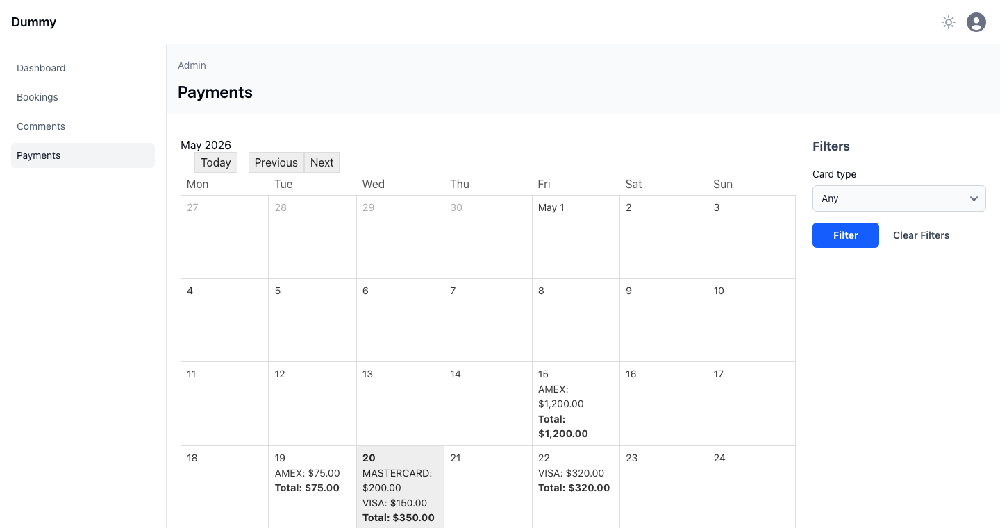
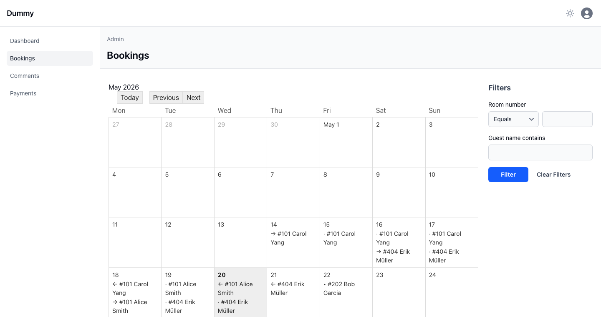

# activeadmin_calendar

Adds `index as: :calendar` to ActiveAdmin — renders the resource list as a
month grid with one cell per day. The index block is yielded
`(date, records_for_that_day)`.

Works with **ActiveAdmin 3.5+ and 4.x**.



## Install

```ruby
# Gemfile
gem "activeadmin_calendar"
```

For Sprockets (AA 3):

```scss
/* app/assets/stylesheets/active_admin.scss */
@import "activeadmin_calendar";
```

Propshaft / Tailwind (AA 4) picks the bundled CSS up automatically.

## Usage

### Single-date events — `group_by:`

One SQL query per visible month, rows bucketed in Ruby.

```ruby
ActiveAdmin.register Payment do
  config.paginate = false
  filter :card_type, as: :select, collection: Payment::CARD_TYPES

  index as: :calendar, group_by: :paid_at do |date, payments|
    by_card = payments.group_by(&:card_type)
                      .transform_values { |ps| ps.sum(&:amount) }
    ul do
      by_card.each { |c, sum| li "#{c.upcase}: #{number_to_currency(sum)}" }
      total = by_card.values.sum
      li { strong "Total: #{number_to_currency(total)}" } unless total.zero?
    end
  end
end
```

### Range / fan-out events — `group_by_scope:`

One row appears in **every** day in its active range. Use a custom scope:



```ruby
class Booking < ApplicationRecord
  scope :active_on, ->(date) { where("check_in <= ? AND check_out > ?", date, date) }
end

ActiveAdmin.register Booking do
  filter :room_number
  filter :guest_name_cont, label: "Guest name contains"

  index as: :calendar, group_by_scope: :active_on do |date, bookings|
    ul do
      bookings.sort_by(&:room_number).each do |b|
        first, last = b.check_in == date, b.check_out - 1.day == date
        marker = first && last ? "•" : first ? "→" : last ? "←" : "·"
        li { text_node "#{marker} ##{b.room_number} #{b.guest_name}" }
      end
    end
  end
end
```

May 18 → 21 booking shows on 18 (`→`), 19 (`·`), 20 (`←`).

## Options

| Option | Effect |
|---|---|
| `group_by:` (Symbol) | Bucket by a date/datetime column. **1 SQL** per month (prefetched). |
| `group_by_scope:` (Symbol) | Call `Model.scope(date)` per cell — for ranges, joins, time-zone math. **N SQL** per month (one per visible day). |
| `header:` (String / Proc) | Rendered next to the month title. Proc receives `(collection, current_month)`. |

URL params `?year=2026&month=5` drive the visible month. Today / Previous /
Next links are rendered automatically and preserve current filter params.

Ransack filters apply transparently — the gem buckets the already-scoped
collection. `?q[card_type_eq]=visa` narrows what's shown in each cell.

## Compatibility

| AA | Status |
|---|---|
| 4.0.0.beta22 | ✅ |
| 3.5 | ✅ |

## License

MIT
